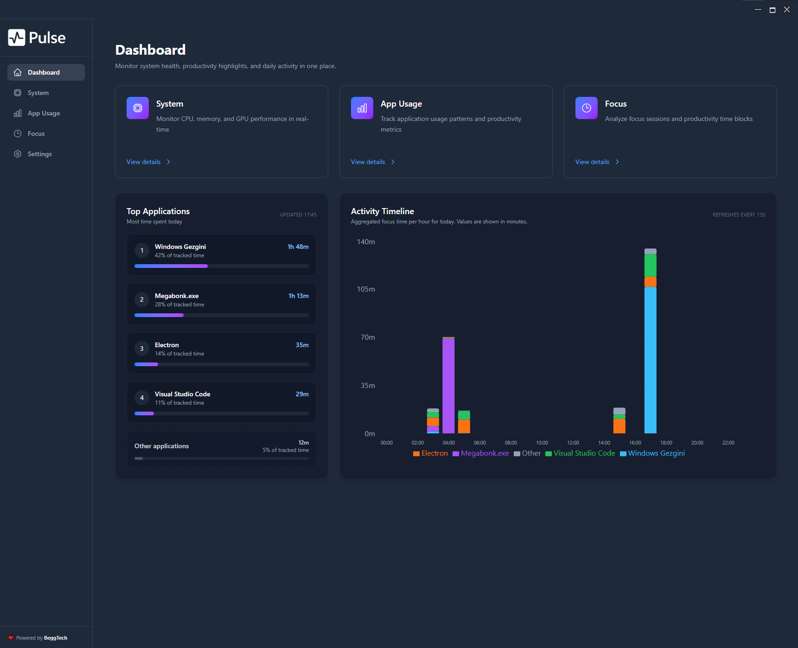
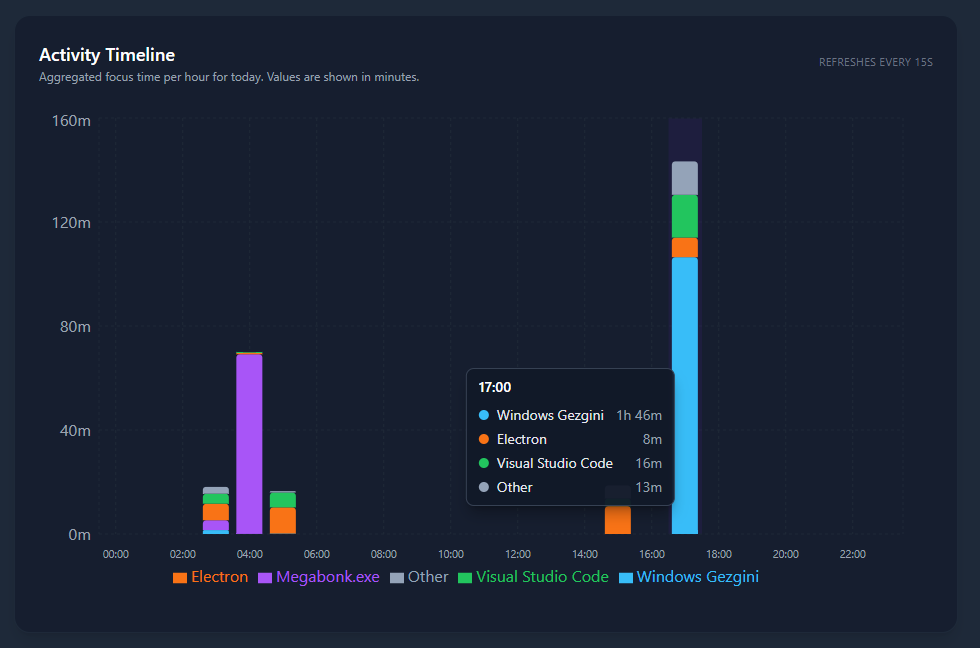
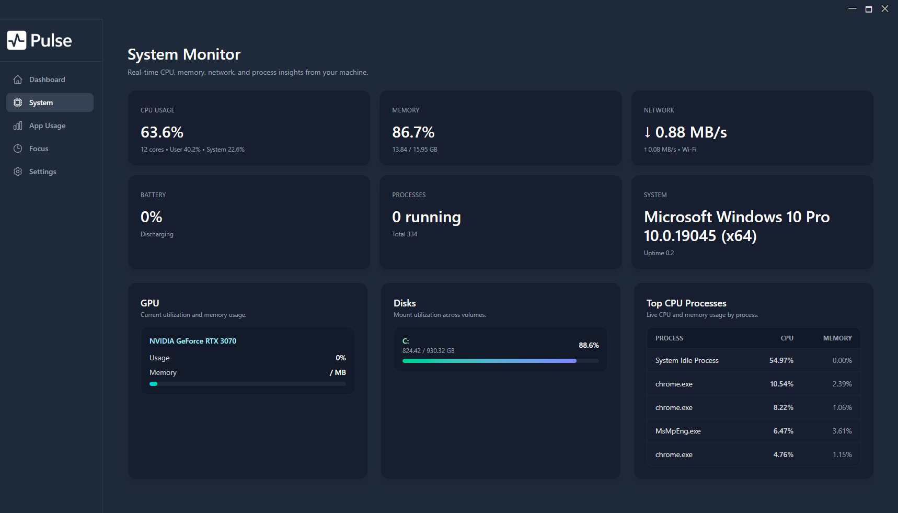
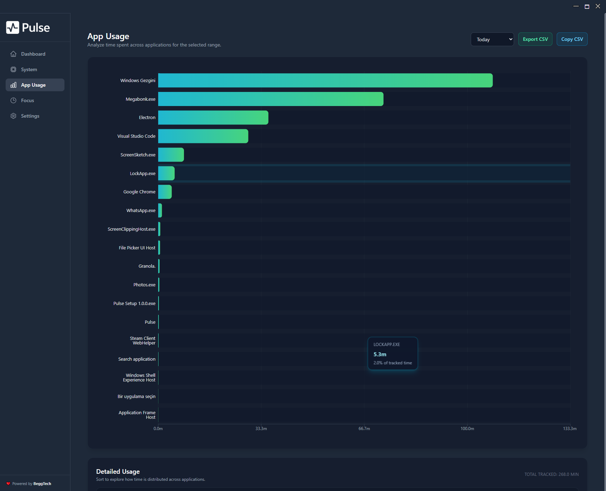
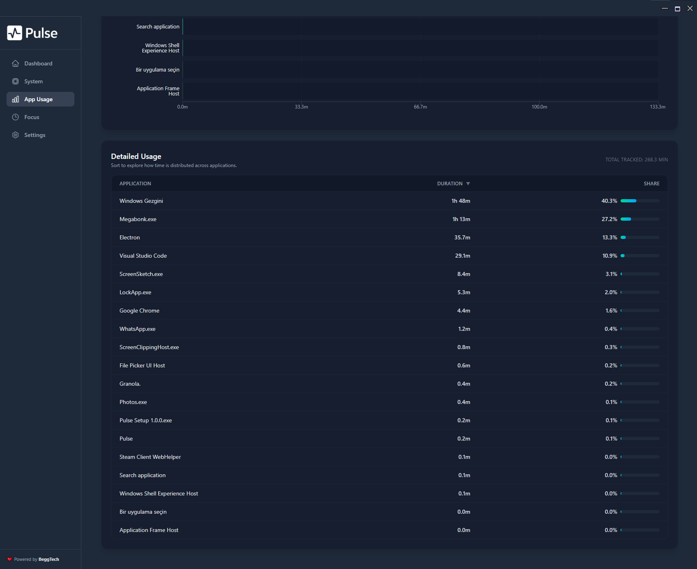
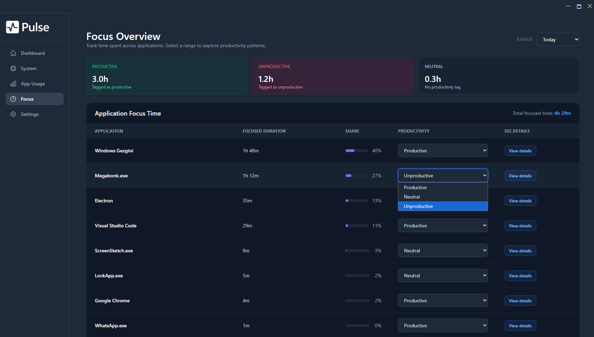
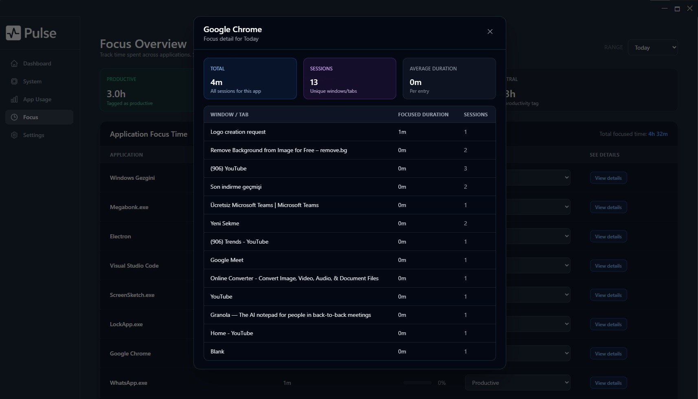

# Pulse

A desktop system monitoring & productivity hub built with **Electron + React (Vite) + Tailwind CSS**. Pulse aims to provide a unified, elegant interface for viewing system information, tracking app / network usage, and focusing with built‑in tools—all in a lightweight, extensible shell.

> Status: Early scaffolding. Core window chrome & layout established. Features below are aspirational unless marked as implemented.

## ⬇️ Download
- [Pulse Setup 1.0.0 (Windows)](https://github.com/ozandndar/Pulse/blob/main/dist/Pulse%20Setup%201.0.0.exe?raw=1)

## Screenshots



|  |  |
| --- | --- |
|  |  |
|  |  |
|  |  |
|  |  |


## ✨ Features
- Custom frameless window with draggable title bar & window controls
- Modular sidebar navigation
- Dashboard landing view
- System metrics (CPU / Memory / Disk / GPU)
- App usage analytics & focus tracking
- Network throughput & connectivity insights
- Theming & adaptive layout
- Settings pane with configuration persistence
- Typed preload API exposing minimal, validated IPC surface

## 🧱 Tech Stack
| Layer | Technology |
|-------|------------|
| Runtime Shell | Electron ^38 |
| Frontend | React 19 + React Router 7 |
| Bundler (Renderer) | Vite 7 |
| Styling | Tailwind CSS 4 (next) + PostCSS + Autoprefixer |
| Language | TypeScript 5 |
| Dev Utilities | concurrently, electronmon, wait-on, cross-env |

## 🗂 Project Structure
```
root
├─ package.json            # Root scripts (Electron main / orchestration)
├─ tsconfig.json           # TypeScript config for main process
├─ main/                   # Electron main & preload scripts
│  ├─ main.ts
│  └─ preload.ts
├─ renderer/               # React (Vite) application
│  ├─ package.json
│  ├─ vite.config.ts
│  ├─ tailwind.config.ts
│  ├─ postcss.config.js
│  ├─ index.html
│  └─ src/
│     ├─ index.tsx         # React entry; mounts <App/>
│     ├─ index.css         # Tailwind import + base custom styles
│     ├─ components/
│     │  ├─ TitleBar.tsx
│     │  ├─ Sidebar.tsx
│     │  └─ Powered.tsx
│     └─ routes/
│        └─ Dashboard.tsx
└─ dist/                   # Build output (generated)
   ├─ main/                # Compiled main process JS
   └─ renderer/            # Vite build output
```

## 🔧 Scripts (Root)
| Script | Purpose |
|--------|---------|
| `npm run dev` | Run renderer dev server & watch main process concurrently. Starts Electron after Vite is ready. |
| `npm run dev:renderer` | Start only the Vite dev server (renderer). |
| `npm run dev:main` | Watch/recompile main TS & launch Electron when renderer is up. |
| `npm run watch:main` | TypeScript watch compile for `main/`. |
| `npm run run:electron` | Launch Electron (dev) pointing at compiled main & waiting for port 5173. |
| `npm run build:main` | Build only the main process TypeScript. |
| `npm run start:main` | Build main & run Electron loading built renderer assets (requires a renderer build). |

### Renderer Scripts (`renderer/`)
| Script | Purpose |
|--------|---------|
| `npm run dev` | Vite dev server on port 5173. |
| `npm run build` | Production build to `dist/renderer` (relative to root). |
| `npm run preview` | Preview built renderer locally. |

## ▶️ Getting Started
### Prerequisites
- Node.js 18+ (recommended LTS)
- npm 9+ (or compatible package manager)

### 1. Install Dependencies
The project currently uses separate dependency trees (root + renderer). From the repository root:
```bash
npm install
npm install --prefix renderer
```
(Optional) You may add a postinstall script later to streamline this.

### 2. Run in Development
From the root:
```bash
npm run dev
```
This will:
1. Start Vite (renderer) on `http://localhost:5173`
2. Watch & compile `main/` TypeScript to `dist/main`
3. Launch Electron once the dev server is reachable.

### 3. Build for Production (Current Manual Flow)
```bash
# Build renderer assets
npm run build --prefix renderer
# Build main process
npm run build:main
# Launch Electron using built assets
npm run start:main
```
> Packaging (DMG/EXE/AppImage) is not yet configured. See Roadmap.

## 🏗 Architecture Overview
Electron separates two contexts:
- **Main Process** (`main/main.ts`): Creates a frameless `BrowserWindow`, strips app menu, and routes window control events.
- **Preload** (`main/preload.ts`): Exposes a minimal `electronAPI.windowControl(action)` bridge into the isolated renderer context using `contextBridge`.
- **Renderer** (`renderer/src`) React SPA (HashRouter-based) served via Vite in dev or static files in production.

### IPC & Security
| Aspect | Current State | Notes / Next Steps |
|--------|---------------|--------------------|
| Context Isolation | Enabled implicitly via preload usage | Confirm `contextIsolation: true` explicitly for hardening. |
| Exposed Surface | `windowControl(action)` only | Keep narrow; validate allowed actions server-side if expanded. |
| Navigation | Hash Router | Prevents unexpected file navigations. |
| Window Frame | Disabled (`frame: false`) | Custom UI; ensure accessible controls. |

### Suggested Hardening (Future)
- Explicitly set `webPreferences`: `contextIsolation: true`, `sandbox: true` (test compatibility), `nodeIntegration: false`.
- Add type-safe IPC channels & validation.
- Integrate ESLint + Prettier for consistent code quality.
- Add an Electron packager (electron-builder or Forge) with notarization pipeline.

### Page Specifications
| Page | Key UI Elements | Notes |
|------|-----------------|-------|
| Dashboard | Most used app, Total active time, Top 3 apps bar, CPU/RAM mini sparklines, date switcher | Quick daily glance |
| App Usage | Date picker, bar chart (Top N), table (name, total, %, sessions), detail drawer with session list | Supports CSV export |
| System | Line charts CPU/RAM/GPU (15m/1h/24h), stats (min/avg/max) | Graceful GPU fallback |
| Network | RX/TX line charts, peak badges | Future: latency & packet loss |
| Daily Focus | Timeline (focus blocks), active vs idle totals, streak metrics | Visual productivity insight |
| Settings | Sampling intervals, idle threshold, GPU method, retention, export/import DB, permissions help | Validated forms |

### Proposed Expanded Folder Structure (Future)
```
root
├─ main/
│  ├─ main.ts
│  ├─ preload.ts
│  ├─ ipc.ts
│  ├─ db.ts
│  ├─ sampling/
│  │  ├─ activeWindow.ts
│  │  ├─ systemStats.ts
│  │  └─ networkStats.ts
│  └─ services/
│     └─ aggregator.ts
├─ renderer/
│  └─ src/
│     ├─ routes/
│     │  ├─ Dashboard.tsx
│     │  ├─ AppUsage.tsx
│     │  ├─ System.tsx
│     │  ├─ Network.tsx
│     │  ├─ Focus.tsx
│     │  └─ Settings.tsx
│     ├─ components/
│     │  ├─ Sidebar.tsx
│     │  ├─ Chart.tsx
│     │  ├─ Card.tsx
│     │  └─ ...
│     ├─ hooks/
│     │  └─ useLiveSystem.ts
│     ├─ lib/
│     │  ├─ time.ts
│     │  └─ format.ts
│     └─ types/
│        └─ api.ts
```

### Data & Storage (Planned)
| Concern | Plan |
|---------|------|
| Storage | SQLite (better-sqlite3) local file (e.g., `pulse.db`). |
| Sampling Interval | Configurable (default 2000ms system stats, 1000ms active window debounce). |
| Idle Detection | Use last input; if idle > threshold (seconds) pause active window accumulation. |
| Retention | Periodic pruning of samples older than `retentionDays`. |
| Export/Import | Simple dump & restore of SQLite / or JSON export for sessions and samples. |

### Permissions & OS Notes
- macOS requires Accessibility for active window tracking; show first‑run modal with instructions.
- GPU metrics may not be available on all platforms; display a neutral "Not supported" state with docs link.
- Sandbox & hardened runtime considerations when packaging (future).

### UI / Styling Guidelines
- Use Tailwind utility classes: `rounded-2xl`, subtle shadow, spacing `p-4 p-6`, responsive grids.
- Consistent card component for metric panels.
- Charts should adapt to dark background; prefer neutral color palette with accent highlights.
- Minimize layout shift; skeleton loaders for async data.

<!-- Roadmap moved to separate TODO file -->

## 🎨 Styling
Tailwind v4 (next) via `@tailwindcss/postcss`. The CSS entry `index.css` imports Tailwind and adds a custom scrollbar + container class. Extend theming in `tailwind.config.ts` as features grow.

## 🧪 Testing (Planned)
No test harness yet. Potential stack:
- Unit/Component: Vitest + React Testing Library
- E2E (Renderer): Playwright
- Smoke (Electron): Spectron alternative (Playwright + Electron).

<!-- Roadmap & contributing sections removed; see TODO file for development plan. -->

## 📄 License
Licensed under **ISC** (per current `package.json`). You may replace with MIT or another license later—ensure both root & renderer `package.json` match.

## 🙋 FAQ (Seed)
| Question | Answer |
|----------|--------|
| Why two package.json files? | Separates Electron (main) dependencies from renderer web stack for clearer builds. |
| Why HashRouter? | Avoids custom protocol / deep linking setup early on; works in packaged app. |
| How do I add a new page? | Create a component under `renderer/src/routes/` and add a `<Route>` plus a nav entry in `Sidebar.tsx`. |

<!-- Future enhancements moved to TODO backlog -->

## 📌 Notes
This README was auto-generated based on the current codebase snapshot (early stage). Update as architecture & features evolve.

---
Made with ❤️ by BeggTech
